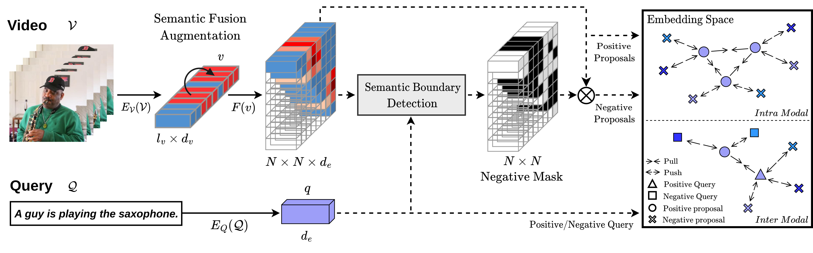

# Semantic Fusion Augmentation and Semantic Boundary Detection: A Novel Approach to Multi-Target Video Moment Retrieval

This is the official implementation of the paper [Semantic Fusion Augmentation and Semantic Boundary Detection: A Novel Approach to Multi-Target Video Moment Retrieval]() (WACV 2024).




## Pyhton Environments
- Install python packages.
    ```sh
    $ pip install -r requirements.txt
    ```
- (Optional) Boost mAP calculation.
    ```sh
    $ python setup.py install
    ```


## Datasets
- The datasets can be downloaded from our [OneDrive](https://nycu1-my.sharepoint.com/:f:/g/personal/vin30731_ee10_m365_nycu_edu_tw/Eh77TzJT5MJHm-Wkhmg-A8EBszux3d6v39y4hu1EsjuNAA?e=UpV9mx).

- The folder structure should be like this:
    ```
    ./data
    ├── ActivityNet
    │   ├── C3D
    │   │   └── activitynet_v1-3_c3d.hdf5
    │   ├── I3D
    │   │   ├── v_00Dk03Jr70M.npy
    │   │   ├── v_00KMCm2oGhk.npy
    │   │   ├── ...
    │   ├── multi_test.json
    │   ├── test.json
    │   ├── train.json
    │   └── val.json
    ├── CharadesSTA
    │   ├── VGG
    │   │   └── vgg_rgb_features.hdf5
    │   ├── C3D
    │   │   └── Charades_C3D.hdf5
    │   ├── I3D
    │   │   └── features
    │   │       ├── 001YG.npy
    │   │       ├── 003WS.npy
    │   │       ├── ...
    │   ├── multi_test.json
    │   ├── test.json
    │   └── train.json
    └── QVHighlights
        ├── features
        │   ├── clip_features
        │   ├── clip_text_features
        │   └── slowfast_features
        ├── test.json
        ├── train.json
        └── val.json
    ```

## Training

All our training configuration files are in the `./configs` folder. The training command is as follows:

- Single GPU training.
    ```sh
    $ python main.py --config path/to/config.json --logdir path/to/log/dir
    ```
    For example, to train the model on CharadesSTA dataset with VGG backbone:
    ```sh
    $ python main.py --config ./configs/charades-VGG.json --logdir ./logs/charades-VGG-log
    ```

- Multi-GPU training.
    For example, to train the model on CharadesSTA dataset with VGG backbone on 4 GPUs:
    ```sh
    $ CUDA_VISIBLE_DEVICES=0,1,2,3 python main.py --config ./configs/charades-VGG.json --logdir ./logs/charades-VGG-log
    ```

## Pretrained Models
The pretrained models used in our paper can be downloaded from [OneDrive](https://nycu1-my.sharepoint.com/:f:/g/personal/vin30731_ee10_m365_nycu_edu_tw/EpZ0TOQDHdVBkE-PSbmt_IIBF9hDj3nXDvxBDSHg4jdOPw?e=KczAkv).

- It is recommended to put the pretrained models in the `./logs` folder.
    ```
    ./logs
    ├── activity-C3D-log
    │   ├── ...
    ├── activity-I3D-log
    │   ├── ...
    ├── charades-C3D-log
    │   ├── ...
    ├── charades-I3D-log
    │   ├── ...
    ├── charades-VGG-log
    │   ├── best.pth
    │   └── config.json
    └── qv-log
        ├── ...
    ```

- Reproduce the results in our paper. Take the CharadesSTA dataset as an example:
    ```sh
    $ python main.py --test_only --config ./logs/charades-VGG-log/config.json  --logdir ./logs/charades-VGG-log
    ```

## Citation
If you find this code useful for your research, please cite our paper:
```
@InProceedings{Huang_2024_WACV,
    author    = {Cheng Huang, Yi-Lun Wu, Hong-Han Shuai, Ching-Chun Huang},
    title     = {Semantic Fusion Augmentation and Semantic Boundary Detection: A Novel Approach to Multi-Target Video Moment Retrieva},
    booktitle = {Proceedings of the IEEE/CVF Winter Conference on Applications of Computer Vision (WACV)},
    month     = {January},
    year      = {2024}
}
```
